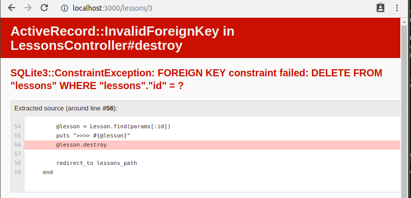

```
<p>
  <%= link_to 'Destroy Comment', [comment.lesson, comment],
               method: :delete,
               data: { confirm: 'Are you sure?' } %>
</p>
```

> `comment.lesson` is possible because of the association defined before

this fires a `DELETE /lessons/lesson_id/comments/:id` to CommentsController#destroy...

which can then use this to find the comment we want to delete


```ruby
    def destroy
        @lesson = Lesson.find(params[:lesson_id])
        @comment = @lesson.comments.find(params[:id])
        @comment.destroy
        redirect_to lesson_path(@lesson)
    end
```


## Deleting associated objects

```ruby
class Lesson < ApplicationRecord
    has_many :comments, dependent :destroy
    ...
end
```

`dependent` option of an associaation
- such that when a Lesson is deleted, the associated comments will also need to be deleted

- otherwise, they would be "orphans" in the database, but some use cases calls for that
- maybe "retiring" is like this?

WIthout this, yoou'll actually get an error


